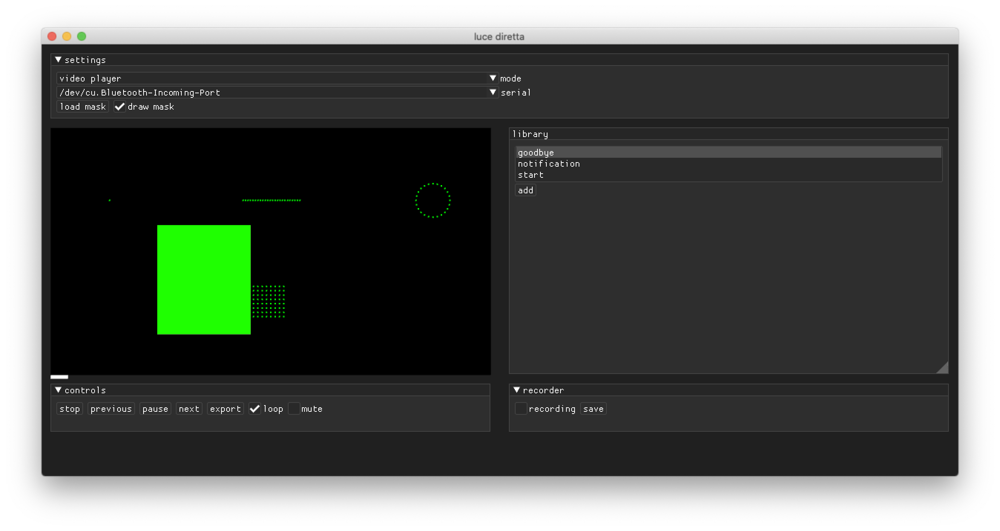
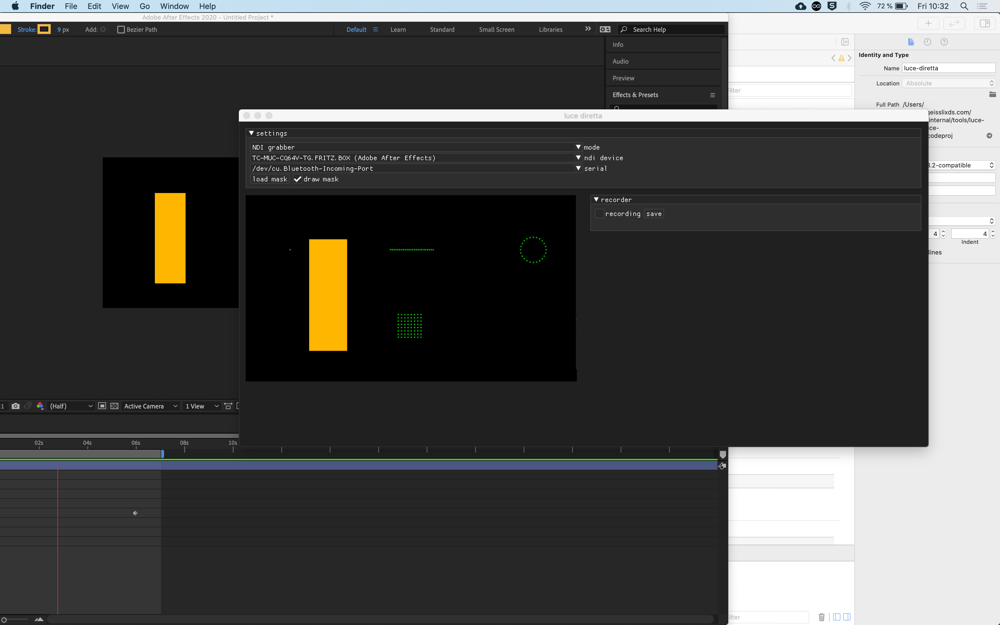

# luce diretta - direct light
This is a work in progress and mostly broken.


videoplayer input            |  NDI grabber input
:-------------------------:|:-------------------------:
  |  


luce diretta will be your friend if you need to design led animations and wanna preview them directly on led strips instead of screens.
It can work with ndi streams, rendered video files, web cam input and syphon. 

luce diretta can record and export animations as c++ header files to be used standalone on your favourite microcontroller. 

## Usage
### Command line arguments
luce diretta accepts command line arguments. If you start the app from the terminal, you can set the following options:
* -m, --mode : [NDIGRABBER, VIDEOPLAYER, VIDEOGRABBER, SYPHON]
* -M, --mask : absolute path to the svg mask

### Masks
Masks are simple svg files. The aspect ratio should match the input's aspect ratio.
luce diretta parses the **svg**'s direct children of type **rect** and uses their position to pick the colour information. The order of apperance gets mapped to pixel index. Width and Height of the **rect** element are ignored, only its x and y position matters.

```
<?xml version="1.0" encoding="UTF-8"?>
<svg width="3840px" height="2160px" viewBox="0 0 3840 2160" version="1.1" xmlns="http://www.w3.org/2000/svg" xmlns:xlink="http://www.w3.org/1999/xlink">
    <!-- Generator: Sketch 58 (84663) - https://sketch.com -->
    <title>Artboard</title>
    <desc>Created with Sketch.</desc>
        <rect id="point" fill="#D8D8D8" x="507" y="707" width="16" height="16"></rect>
        <rect id="line0" fill="#D8D8D8" x="1672" y="707" width="16" height="16"></rect>
        <rect id="line1" fill="#D8D8D8" x="1693" y="707" width="16" height="16"></rect>
        <rect id="line2" fill="#D8D8D8" x="1715" y="707" width="16" height="16"></rect>
</svg>
```

It might be neccessary to adapt the mask to fit the rules above, e.g. remove wrapper tags, sketch usually adds a wrapping **g** tag.
## Building
### osx
Xcode needs an extra run script to fix the rpath issue with dynamic libs. 

```
cp "./local_addons/ofxNDI/libs/libndi/lib/osx_x64/libndi.3.dylib"  "$TARGET_BUILD_DIR/$PRODUCT_NAME.app/Contents/MacOS/"
install_name_tool -change @rpath/libndi.3.dylib @executable_path/libndi.3.dylib "$TARGET_BUILD_DIR/$PRODUCT_NAME.app/Contents/MacOS/$PRODUCT_NAME";

```
## Dependencies
### Arduino
    - Neopixel: https://github.com/adafruit/Adafruit_NeoPixel
    - PaketSerial: https://github.com/bakercp/PacketSerial
